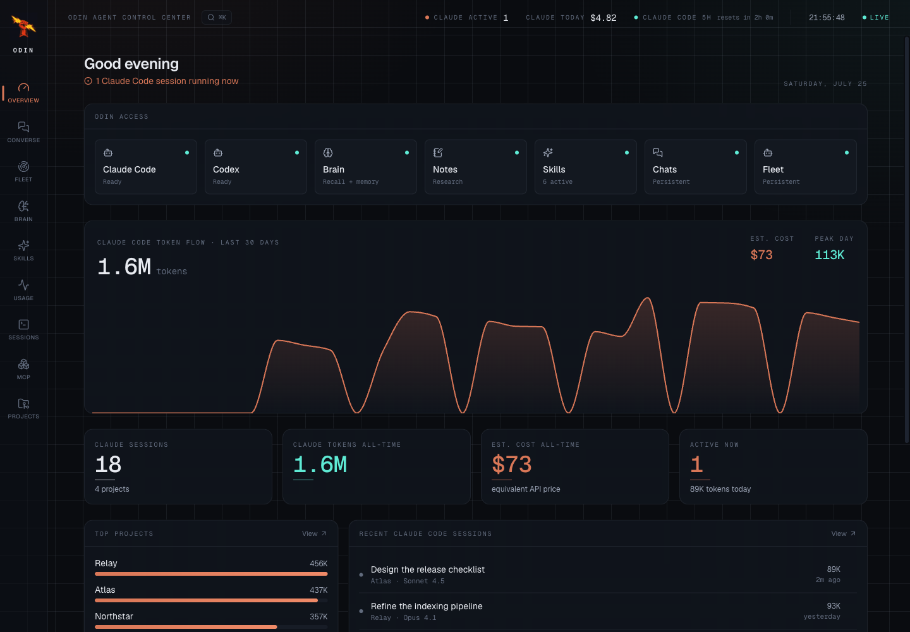
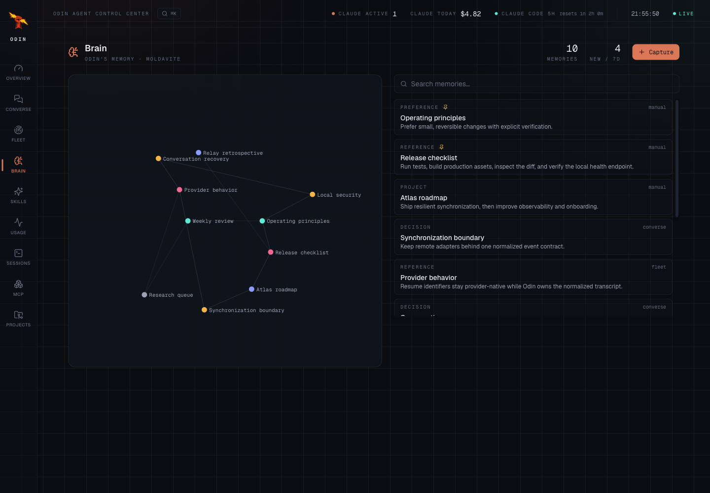
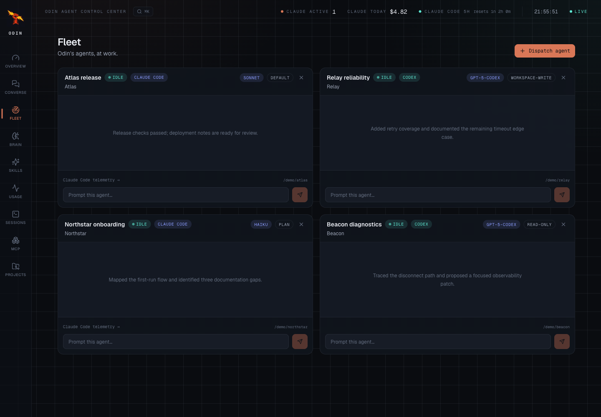
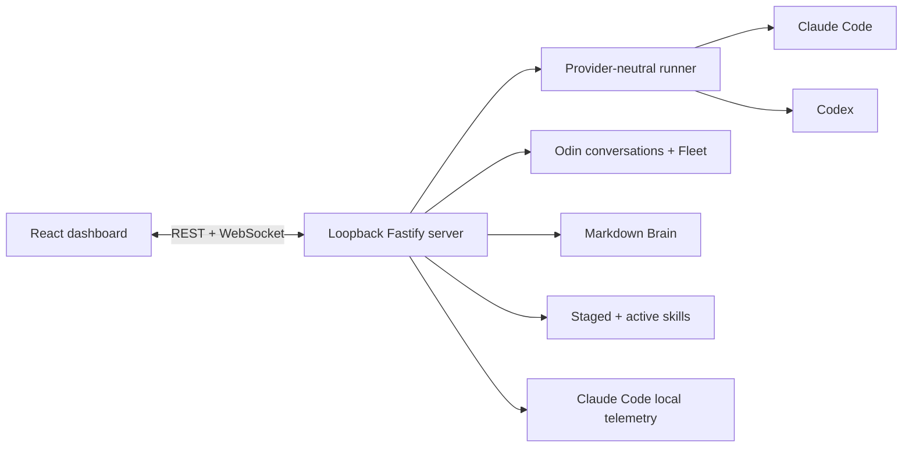

# Odin

Odin is a local-first control center for Claude Code and OpenAI Codex. It combines durable
conversations, parallel project agents, Markdown memory, reviewed procedural skills, and a live
view of local Claude Code activity in one dashboard.



> [!IMPORTANT]
> Odin is a single-user application for a trusted local machine. It has no login or network-facing
> authentication and must not be exposed through a reverse proxy, port forward, public tunnel, or
> LAN binding. Prompts and selected local context are sent to the provider you choose.

## Highlights

- **Converse:** resumable conversations backed by Claude Code or Codex.
- **Fleet:** persistent project agents that can run independently through either provider.
- **Brain:** linked Markdown memories recalled before work and distilled after successful turns.
- **Skills:** installed Claude plugin inventory plus Odin-authored skills that remain staged until
  explicitly reviewed and activated.
- **Claude telemetry:** sessions, transcripts, token usage, estimated cost, projects, MCP servers,
  subscription details, and recent activity from local Claude Code state.
- **Local dashboard:** Fastify REST/WebSocket server and a responsive React interface.
- **macOS launcher:** an optional signed local app wrapper with process ownership and crash recovery.



Open Brain's expanded memory constellation to filter memories by type, zoom with the controls,
mouse wheel, or `+` and `-`, and pan by dragging. Arrow keys move between nodes, `Enter` opens a
memory, and `0` resets the view.

## Provider Support

| Capability | Claude Code | Codex |
| --- | --- | --- |
| Converse and native resume | Yes | Yes |
| Fleet agents | Yes | Yes |
| Brain recall and post-turn memory | Yes | Yes |
| Active Odin skills | Yes | Yes |
| Optional personal-note tools | Yes | Yes |
| Sessions, usage, projects, MCP, and plan telemetry | Yes | No |

Odin does not proxy one provider through another. It launches the selected local provider runtime,
uses that runtime's existing authentication, and normalizes streaming events for the dashboard.



## Quick Start

Requirements:

- Node.js 20 or newer
- npm
- Claude Code and/or Codex configured on the local machine

```bash
npm install
npm run dev
```

The development dashboard opens at `http://localhost:5173`; the API listens on
`http://127.0.0.1:7420`.

For a production build:

```bash
npm run build
npm start
```

The production server serves the dashboard at `http://127.0.0.1:7420`.

### Try the Synthetic Demo

The built-in read-only demo does not require a configured provider and does not inspect live Claude,
Codex, Brain, conversation, Fleet, skill, note, or credential state:

```bash
npm run demo
```

Open `http://127.0.0.1:7420`. A persistent `Demo · read only` badge identifies the mode. Every
dashboard response comes from a fixed in-memory fixture, write controls are disabled, and the server
rejects API mutations. Set `HELM_PORT` before the command to use another port.

See [Setup](docs/setup.md) for provider authentication, environment variables, optional notes,
production operation, and the macOS app installer.

## How It Works



Odin owns its normalized conversation history and Fleet metadata. Provider-native sessions remain
under their provider's control. Before a run, Odin can inject relevant Brain notes as untrusted
reference data. After a successful turn, a separate best-effort provider call can distill durable
facts and reusable procedures. New procedures are staged and never become active automatically.
Set `ODIN_LIBRARIAN_ENABLED=0` to disable all automatic post-turn provider calls.

Read [Architecture](docs/architecture.md) for the lifecycle and component boundaries.

## Safety Model

- The server binds to `127.0.0.1` and rejects non-loopback `Host` and `Origin` values.
- Provider processes are launched without a shell.
- Paths, models, access modes, slugs, and request bodies are validated.
- Dangerous full-access modes are disabled unless `ODIN_ALLOW_BYPASS=1` is set.
- Fleet tools inherit the orchestrating conversation's access ceiling and target discovered projects.
- Odin-owned state directories use owner-only permissions where supported.
- Automatic memory cannot overwrite pinned or manually authored notes.
- Model-authored skills are staged for human review before activation.
- Secret redaction is best-effort and is not a substitute for keeping secrets out of prompts.
- Remote images in model-authored Markdown are not loaded automatically.

The local API can expose transcripts, paths, account details, notes, and skill contents to any local
process able to reach it. Read [Security and Data](docs/security-and-data.md) before using Odin with
sensitive work.

## Data Locations

| Data | Default location |
| --- | --- |
| Conversations and Fleet | `~/.odin/` |
| Brain | `~/Documents/Moldavite/Odin/` |
| Forged skills | `~/.claude/odin-skills/` |
| Claude telemetry source | `~/.claude/` and `~/.claude.json` |
| Codex provider state | `$CODEX_HOME` or `~/.codex/` |
| macOS launcher state | `~/Library/Application Support/Odin/` |
| macOS server log | `~/Library/Logs/Odin/odin.log` |

Uninstalling the macOS app does not erase conversations, Brain notes, skills, or provider-native
history. See [Security and Data](docs/security-and-data.md#storage-and-deletion) for exact deletion
semantics.

## macOS App

```bash
bash scripts/install.sh
```

This builds Odin and creates `/Applications/Odin.app`. The app starts this checkout's production
server, verifies its identity and health, restarts only the server it owns, and opens the dashboard.
It does not install a login item.

```bash
bash scripts/uninstall.sh
```

The uninstaller removes the app, launcher state, logs, and its owned server process. Reinstall after
moving the checkout or changing the configured port.

## Documentation

- [Setup](docs/setup.md)
- [Architecture](docs/architecture.md)
- [Security and Data](docs/security-and-data.md)
- [Configuration and API Reference](docs/reference.md)
- [Troubleshooting](docs/troubleshooting.md)
- [Contributing](CONTRIBUTING.md)
- [Security Policy](SECURITY.md)

## Development

```bash
npm run test
npm run build
# or both
npm run check

# one-time browser install, then the complete suite
npx playwright install chromium
npm run check:all
```

The repository is an npm workspace with `server/` and `web/` packages. See
[Contributing](CONTRIBUTING.md) for project conventions, test expectations, and privacy rules for
fixtures and screenshots.

## Project Status

Odin is early-stage software. The local API is unversioned. Automated tests cover persistence,
provider normalization, memory and skill boundaries, loopback request security, demo isolation, and
desktop/mobile browser flows. The macOS launcher is the only packaged desktop flow.

## License

[MIT](LICENSE)
