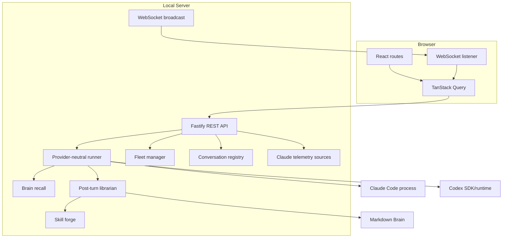

# Architecture

Odin is an npm-workspace monorepo with a React dashboard and a loopback Fastify server. The server
owns orchestration, persistence, telemetry parsing, memory, and skill lifecycle behavior; the browser
is a local presentation and control layer.

## Components



## Repository Layout

```text
server/
  src/index.ts          HTTP, WebSocket, startup, and shutdown
  src/providers/        Provider adapters and normalized event types
  src/sources/          Read-only local telemetry and dashboard DTOs
  src/converse.ts       Conversation metadata and transcript persistence
  src/fleet.ts          Persistent worker-agent lifecycle
  src/memory/           Brain storage, recall, and librarian
  src/skills/           Forged-skill storage and activation
web/
  src/screens/          Route-level dashboard screens
  src/components/       Shared shell and interaction components
  src/lib/              API, DTOs, streaming hooks, and formatting
scripts/                macOS install and uninstall flows
```

## Provider Contract

`server/src/providers/types.ts` defines provider identifiers, capabilities, run options, normalized
events, and running-process controls. Claude Code and Codex adapters translate native streams into
the same event model:

- `start` and `init`
- `thinking` and `text`
- `tool_use` and `tool_result`
- `result`, `rate_limit`, `error`, and `exit`

The normalized layer lets Converse and Fleet share persistence and UI behavior without pretending
the providers have identical permission, model, resume, or telemetry capabilities.

Provider choice is immutable for an existing conversation. Odin stores the provider-native session
or thread identifier alongside its own conversation UUID so later turns resume the correct runtime.

## Converse Lifecycle

1. The server validates provider, working directory, model, access mode, message, and optional resume
   metadata.
2. Odin reserves the conversation so only one run can be active for it.
3. Relevant Brain memories and enabled tool configurations are assembled.
4. The selected provider starts without a shell and streams normalized events.
5. Events are broadcast over WebSocket and appended to Odin's JSONL transcript.
6. On a successful result, conversation metadata is updated and a best-effort librarian job is
   queued.
7. Shutdown stops accepting new work, terminates active providers, flushes persistence, and waits for
   librarian work within the shutdown boundary.

The React conversation provider lives above the router, so route changes do not discard a live run.

## Fleet Lifecycle

Fleet agents are persistent records with a provider, project, working directory, model, access mode,
status, provider-native resume identifier, and last summary. Prompting an agent reserves it before
the provider launch, preventing simultaneous startup races. Different agents may run concurrently;
one agent may have only one active run.

The Fleet MCP server gives an orchestrating Converse run tools to dispatch, list, prompt, and stop
workers through the same local API used by the dashboard. It can target only projects discovered by
Odin, maps new workers to the orchestrator's access ceiling, and refuses to prompt an existing worker
with broader access.

## Brain

The Brain is a Moldavite-compatible directory of Markdown notes with optional YAML frontmatter and
wiki links. The storage layer is the only module that writes Brain files.

Recall is deterministic:

1. Load available notes.
2. Rank pinned notes, project matches, keyword matches, and recent notes.
3. Fit excerpts into a bounded context block.
4. Mark all recalled content as untrusted reference data, never instructions.

Remembering is provider-backed and asynchronous. After a successful turn, the librarian requests
structured memory and skill candidates. Inputs and outputs receive best-effort secret redaction.
Automatic notes cannot replace pinned or manually authored notes and are never pinned automatically.
The extraction process runs in a temporary directory with tools, project settings, skills, MCP
servers, hooks, and session persistence disabled.

## Skills

The Skills screen combines installed Claude plugin metadata with Odin's own skill store. A
model-authored skill is written to `staged/`, provenance-stamped, size-limited, redacted, and scrubbed
of common URL forms. It is not supplied to either provider until the user reviews and activates it. File moves
and deletion enforce path containment and reject symlink escapes.

## Telemetry Sources

Source modules read Claude Code's local state and return plain DTOs. They never mutate
provider-owned files. Sources cover sessions, transcripts, daily activity, estimated cost, projects,
MCP configuration, plugin inventory, and plan information. File watchers invalidate source caches and
push a lightweight change event over WebSocket; clients then refetch the affected query.

“Live” sessions are inferred from recent transcript activity, not verified process liveness.

## Persistence

Conversation and Fleet writes are serialized and use atomic replacement where appropriate. A corrupt
conversation registry is preserved and blocks replacement rather than being overwritten. A corrupt
Fleet registry is moved to a timestamped backup. Truncated transcript tails are tolerated.

Server and frontend DTOs currently live in separate TypeScript files and must be kept aligned by
hand.
